<!-- ================== POWER BI QUICK START README ================== -->

  

<h1 align="center">📊 Power BI Quick Start — Interactive Dashboards</h1>

A <b>skill-focused, practice-driven Power BI repository</b> designed to demonstrate  
<strong>end-to-end dashboard creation skills</strong> — from raw data to  
<strong>interactive, business-ready insights</strong>.

---

## 🔥 Repository Insights & Activity

---

  
  
  
  

## 🚀 What This Repository Demonstrates

| Level         | Focus Area                             |
| ------------- | -------------------------------------- |
| 🔹 Foundation | Power BI Interface, Data Loading       |
| 🧹 Data Prep  | Power Query, Cleaning, Transformations |
| 🔗 Modeling   | Relationships, Data Model Design       |
| 🧠 DAX        | Measures, Calculated Columns           |
| 📊 Visuals    | Charts, KPIs, Slicers                  |
| ⚙️ Dashboards | Interactive Layouts                    |
| 📈 Insights   | Business Interpretation                |

---

## 🧠 Why Power BI?

✔ Microsoft’s industry-leading BI tool
✔ Converts complex data into **clear insights**
✔ Widely used by **analysts, managers & executives**
✔ Essential skill for **Data Analyst & BI roles**
✔ Strong integration with **Excel, SQL & Cloud data**

---

## 🎯 Objectives of This Repository

* Showcase **Power BI dashboard creation skills**
* Demonstrate **data modeling & DAX capability**
* Build **portfolio-ready analytics projects**
* Apply **business thinking to data**
* Create **interactive & insight-driven dashboards**

---

## 🌈 Power BI Learning Roadmap (Creative Flow)

```mermaid
flowchart LR

    A[🚀 Start Power BI Journey]:::start --> B[📂 Import Data]:::basic
    B --> C[🧹 Power Query Cleaning]:::basic

    C --> D[🔗 Data Modeling]:::intermediate
    D --> E[🧠 DAX Measures]:::intermediate

    E --> F[📊 Charts & KPIs]:::visual
    F --> G[🎛️ Slicers & Filters]:::visual

    G --> H[⚙️ Dashboard Design]:::advanced
    H --> I[📈 Business Insights]:::deploy

    I --> J[🏆 Portfolio-Ready Dashboards]:::deploy

    classDef start fill:#0f172a,color:#ffffff,stroke:#38bdf8,stroke-width:2px
    classDef basic fill:#ecfeff,color:#0f172a,stroke:#06b6d4,stroke-width:2px
    classDef intermediate fill:#fef3c7,color:#78350f,stroke:#f59e0b,stroke-width:2px
    classDef visual fill:#ede9fe,color:#4c1d95,stroke:#8b5cf6,stroke-width:2px
    classDef advanced fill:#dcfce7,color:#14532d,stroke:#22c55e,stroke-width:2px
    classDef deploy fill:#fee2e2,color:#7f1d1d,stroke:#ef4444,stroke-width:2px
```

---

## 🧠 Key Skills Showcased

### 🔹 Data Preparation

* Power Query Transformations
* Data Cleaning & Shaping
* Column & Data Type Optimization

### 🔹 Data Modeling

* Relationships
* Star Schema Concepts
* Model Performance Awareness

### 🔹 DAX & Analytics

* Measures & Calculations
* Aggregations & KPIs
* Business Metric Logic

### 🔹 Dashboards

* Interactive Slicers
* KPI Cards
* Professional Layout Design

### 🔹 Business Storytelling

* Insight-driven visuals
* Executive-level dashboards
* Decision-support analytics

---

## 🛠️ Tools & Technologies Used

| Tool             | Purpose                 |
| ---------------- | ----------------------- |
| Power BI Desktop | Dashboard Development   |
| Excel / CSV      | Data Sources            |
| DAX              | Calculations & Measures |
| Power Query      | Data Transformation     |
| UX Principles    | Dashboard Design        |

---

## 📌 Who This Repository Is For

✔ Students & Beginners

✔ Data Analyst Aspirants

✔ Faculty & Trainers

✔ Professionals upskilling in BI

✔ Portfolio & Interview Preparation

---

## 🧑‍💻 Author

**Ashwin Ananta Panbude**
Data Analyst | Faculty

  

  

---

## 📊 Power BI Quick Start — Short Summary

A hands-on Power BI learning repository focused on building interactive dashboards from scratch.
This project demonstrates practical skills in data preparation, modeling, DAX calculations, dashboard interactivity, and business insight generation—designed for real-world analytics and portfolio presentation.

---

